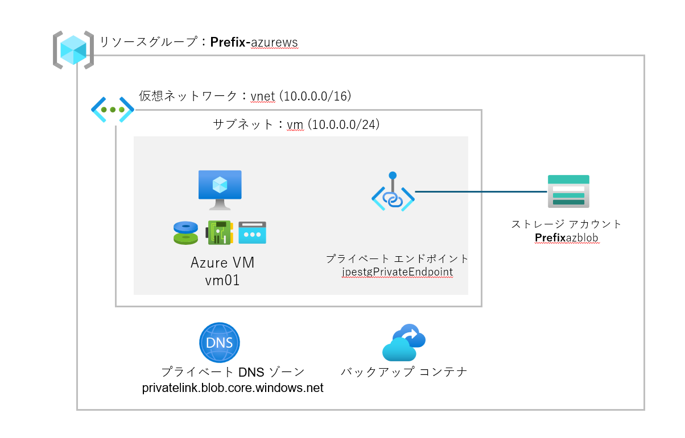

**ハンズオン ラボの概要**
---------------------

このハンズオンラボでは、Azure を利用してクラウド環境でのリソース管理とデータ管理の基礎を学びます。ラボを通じて、仮想マシンの作成、管理、セキュリティ設定、およびストレージソリューションの設定と管理方法を習得します。具体的なビジネス シナリオに基づいて、Azure の実践的なスキルを身につけることを目的としています。

**目次**
----

* 演習 1: Azure にリソースを展開する

  * タスク 1: Azure 仮想マシンを作成する
  * タスク 2: Azure 仮想マシンにログインする
  * タスク 3: Azure 仮想マシン/ディスクをスケール アップする
  * タスク 4: Azure 仮想マシンをバックアップで保護する
* 演習 2: ストレージ

  * タスク 1: Azure Storage を展開する
  * タスク 2: Azure Storage Explorer を使ってファイルをアップロードする
  * タスク 3: プライベート エンドポイントを設定して Storage リソースを保護する
  * タスク 4: Azure Storage の高度な設定を実施する
* ラボのクリーンアップ: リソース グループを削除する

**ストーリー**
----------

仮想の会社「Contoso Inc.」は、急成長中のテクノロジー企業で、主にクラウドベースのソリューションを提供しています。Contoso Inc. は、オンプレミスのインフラストラクチャから Microsoft Azure クラウドへの移行を進めており、その過程でさまざまな Microsoft Azure サービスを活用する計画です。

Contoso Inc. は、社内外のリソースを効率的に管理し、セキュリティを強化し、スケーラブルなストレージソリューションを構築することを目指しています。このハンズオンラボでは、Contoso Inc. の IT チームの一員として、Microsoft Azure の基本的な設定や管理を学びます。

**ソリューション アーキテクチャ**
-----------------------------

以下の図は、このラボで構築するシステムのアーキテクチャを示しています。このラボ シナリオでは Windows 仮想マシンとストレージ アカウントを展開し、それぞれに対して、実シナリオで発生するいくつかの設定や操作を行います。

## 演習 1: Azure に仮想マシンを展開する

Contoso Inc. は、新しい顧客サポートシステム「Project Phoenix」を開発中です。このシステムは、AI を活用した次世代のカスタマーサポートを実現するもので、迅速な開発環境の構築が求められています。あなたは IT チームの一員として、Azure 上に開発環境を構築する任務を任されました。

### タスク 1: Azure 仮想マシンを作成する

Project Phoenix の開発者たちが迅速に作業を開始できるようにするためには、まず Windows Server 2019 仮想マシンを作成する必要があります。あなたは、この仮想マシンを作成し、開発者が必要とする環境を提供します。

1. Web ブラウザで Azure ポータルを開きます。([https://portal.azure.com](https://portal.azure.com))

   認証画面が表示されたら、サブスクリプションの資格情報を入力して、ログインします。
2. [＋リソースの作成] をクリックします。
3. [Windows Server 2019 Datacenter] をクリックします。
4. **基本** タブの項目では、以下の情報を入力します。入力後、[次: ディスク] ボタンをクリックします。

   * リソース グループ: **Prefix** -azurews (新規作成)

     ※ **Prefix** 部分は、任意の文字（ご自身のイニシャルなど）で置き換えてください。

     　リソースグループ名は、同じ Subsciprtion 内で重複できないため、他の参加者の方と重複しないようにしてください。
   * 仮想マシン名: vm01
   * 地域:  (Asia Pacific) Japan East
   * 可用性オプション: インフラストラクチャ冗長は必要ありません
   * サイズ: Standard_D2s_v5
   * ユーザー名: azlabadmin
   * パスワード/パスワードの確認**:** (任意のパスワードを入力)
5. **ディスク** タブの項目では、以下の情報を入力します。入力後、[次: ネットワーク] ボタンをクリックします。

   * OS のディスクの種類: Standard HDD
6. **ネットワーク** タブの項目では、以下の情報を入力します。入力後、[確認および作成] ボタンをクリックします。

   * 仮想ネットワーク: vnet（新規作成）

     ※仮想ネットワークを新規作成する際に、以下の情報を入力します。

     * アドレス範囲: 10.0.0.0/16
     * サブネット名: vm
     * アドレス空間: 10.0.0.0/24
7. **検証に成功しました** のメッセージが出力されたら、[作成] ボタンをクリックします。

   ※仮想マシンのデプロイが完了するまで数分程度要します。
8. **デプロイが完了しました** のメッセージが出力されたら、[リソースに移動] ボタンをクリックします。
9. ネットワークのセキュリティ設定を変更します。

   　1. [ネットワーク] - [ネットワーク設定] を選択します

   　2. [ルール] - [ネットワーク セキュリティグループ] - [受信ポート ルール] 内にある [RDP] ルールをクリックします。 ※青字部分をクリックします

   　3. [ソース] を [My IP address] に変更し、[保存] ボタンをクリックします
10. 作成した仮想マシンの情報を確認します。

> **ポイント**
>
> Azure で作成されるリソース（お客様が作成したインスタンス）は、共通的な管理画面で管理できます。
> [概要] メニューでは、対象のリソースに関する構成情報や状態の確認、頻度の高いオペレーションの実行（起動/停止 など）を行うことができます。また、画面の中ほどにある [監視] タブをクリックするとパフォーマンス情報が、[機能] タブをクリックすると主要な追加機能の構成状態が確認できます。
>
> 仮想マシンの場合は [接続]、[ネットワーク]、「設定」など多数の種類とメニューがあり、どのような情報が確認できるのか？どのような操作ができるのか？を把握することは設計や運用管理の観点でも重要です。

### タスク 2: Azure 仮想マシンにログインする

あなたは、開発者がすぐに利用できる環境を整える必要があります。インターネット経由でログインする際に必要となるセキュリティの確保をしつつ、リモートデスクトップを使用してログインし、基本的な設定を行います。

1. 作成した仮想マシンの画面から [接続] - [接続] をクリックします
2. [接続方法] がパブリック IP アドレスになっていることを確認します
3. [RDP ファイルのダウンロード] ボタンをクリックします
4. ダウンロードが完了したら、RDP ファイルを開きます
5. [接続] ボタンをクリックし、ユーザ名、パスワードを入力します

   * ユーザー名：azlabadmin
   * パスワード：前タスクで指定した任意のパスワード（12文字以上）
6. 証明書エラーの画面は [はい] を選択します
7. デスクトップ画面が表示され、正常に Windows OS にログインできたことを確認します

   ※ 本ラボ シナリオでは Windows OS の設定は行いません

> **ポイント**
>
> Azure VM にログインした後、Microsoft Edge ブラウザを開いて、任意のインターネット サイトを開いてみましょう。（www.bing.com など）
> Azure の仮想ネットワークは、既定でインターネット向けのアウトバウンド通信が許可されます。

### タスク 3: Azure 仮想マシン/ディスクをスケール アップする

開発が進むにつれて、業務アプリケーションの負荷が増加することが予想されます。あなたは、仮想マシンのリソースをスケールアップして、開発チームが高パフォーマンスを必要とする AI モデルを効率的に実行できるようにします。

**仮想マシンをスケール アップする**

1. Azure ポータルで、作成した仮想マシンの画面から [可用性とスケール] - [サイズ] をクリックします
2. 現状のマシン スペックの 2 倍の性能である [**D4s_v5**] を選択し [サイズの変更] ボタンをクリックします
3. 確認メッセージが表示されたら [サイズの変更] ボタンをリックします
4. [概要] メニューから、マシン サイズが変更されたこと、CPU 数やメモリ サイズが変更されたことを確認します

   ※変更後の CPU 数は 4、メモリ サイズは 16GB です

> **ポイント**
>
> 仮想マシンのスペックは、サブスクリプションのクォータの上限内であれば、いつでも自由に変更できます。
> スペック変更は仮想マシンの再起動を伴うため、アプリケーションの中断が発生します。
>
> [仮想マシンのサイズの概要 - Azure Virtual Machines](https://learn.microsoft.com/ja-jp/azure/virtual-machines/sizes/overview?tabs=breakdownseries%2Cgeneralsizelist%2Ccomputesizelist%2Cmemorysizelist%2Cstoragesizelist%2Cgpusizelist%2Cfpgasizelist%2Chpcsizelist)

**ディスクをスケール アップする（HDD から SSD に変更）**

6. 仮想マシンの画面を開き [概要] を表示し [停止] ボタンをクリックします
7. 確認メッセージは [はい] ボタンをクリックします
8. [設定] - [ディスク] を選択し、ディスク名（vm_OsDisk_****）をクリックします
9. [設定] - [サイズおよびパフォーマンス] をクリックし [ストレージの種類] で [Premium SSD (ローカル冗長ストレージ)] を選択します
10. [パフォーマンス レベル] で [P10 - 500 IOPS、100MB/秒（既定値）] を選択し [保存] ボタンをクリックします
11. 仮想マシンの画面を開き [概要] メニューを表示し、[起動] ボタンをクリックします
12. 完了メッセージが出力され、仮想マシンが正常に起動することを確認します

> **ポイント**
>
> ディスクの容量や性能は、必要に応じていつでも変更ができます。
> ディスクのスペック変更ができるのは、ディスクが仮想マシンに接続されていないか、仮想マシンの割り当てが解除されている場合のみです。
>
> [料金 - Managed Disks](https://azure.microsoft.com/ja-jp/pricing/details/managed-disks/)

### タスク 4: Azure 仮想マシンをバックアップで保護する

プロジェクトの成功には、データのセキュリティと安定性が不可欠です。あなたは、データの喪失リスクを軽減し、プロジェクトの安定性を確保するために、仮想マシンのバックアップを構成します。

1. 仮想マシンの画面から [バックアップとディザスタリカバリー] - [バックアップ] をクリックします
2. パラメーターを確認しつつ、既定値のまま [バックアップの有効化] ボタンをクリックします

   ※構成処理に数分程度の時間を要します。
3. [バックアップとディザスタリカバリー] - [バックアップ] をクリックします
4. [今すぐバックアップ] をクリックします
5. [バックアップの保持期限] は既定値のまま [OK] ボタンをクイックします

   ※バックアップ処理の完了時には時間を要します。今回のラボでは、完了までまたず、バックアップの取得操作の実施までを範囲とします。

> **ポイント**
>
> Azure VM のバックアップ構成は、ポータルから簡単に実施できます。（バックアップ用の専用サーバーなどは不要）
> バックアップ処理は、オンラインで行われ、圧縮や暗号化が行われて保存されます。2 回目以降は、増分のみが取得され、効率的なバックアップが自動で行われます。リストアは、VM 単位、ファイル単位、ディスク単位など複数の方法から選択できます。
>
> [Azure VM バックアップの概要](https://learn.microsoft.com/ja-jp/azure/backup/backup-azure-vms-introduction)

**結末と本演習の学び**

これまでのステップで、Project Phoenix の初期段階の開発環境が無事に整いました。開発者たちは、迅速に作業を開始し、AI モデルのテストを始めることができました。あなたは、この一連の作業を通じて、仮想マシンの展開から管理、バックアップ設定までの一連の流れを学びました。クラウド環境での迅速かつ効果的な開発環境の構築方法を理解し、プロジェクトの成功に貢献するための基盤を構築するスキルを身につけました。

## 演習 2: ストレージ

「Project Phoenix」の一環として、顧客フィードバックやサポートログを効率的に保存し、分析するためのストレージソリューションが必要です。あなたは Azure Storageを設定し、安全かつ効率的なデータ管理を実現する任務を担っています。

### タスク 1: Azure Storage を展開する

あなたは、大量のデータを効率的に管理し、分析するための基盤を構築する必要があります。顧客データを安全に保存するために、新しいストレージアカウントを作成します。

1. Azure ポータル上で [＋リソースの作成] をクリックします
2. [カテゴリ] - [ストレージ] を選択し [ストレージ アカウント] - [作成] をクリックします
3. [基本] タブの項目では、以下の情報を入力します。入力後、[確認および作成] ボタンをクリックします。

   * リソース グループ: **Prefix** -azurews (既存のものを選択)
   * ストレージ アカウント名: **Prefix**azblob
     　　  ※ストレージ アカウント名は グローバルでユニークである必要があります
   * 地域:  (Asia Pacific) Japan East
   * 冗長性: ローカル冗長ストレージ（LRS）
4. **検証に成功しました** のメッセージが出力されたら、[作成] ボタンをクリックします

   ※ストレージ アカウントのデプロイが完了するまで数分程度要します
5. **デプロイが完了しました** のメッセージが出力されたら [リソースに移動] ボタンをクリックします
6. 作成したストレージ アカウントの情報を確認します

> **ポイント**
>
> ストレージ アカウントも Azure 仮想マシンと同様の UX で管理することができます。[概要] や [データストレージ]、[セキュリティとネットワーク] などのカテゴリでどのような設定項目があるのか、どのような情報が確認できるのか？を把握することは設計や運用管理の観点でも重要です。

### タスク 2 Azure Storage Explorer を使ってファイルをアップロードする

あなたは、作成した Storage アカウントに対して、データの管理とアクセスを容易にする環境を整備する必要があります。Azure Storage Explorer を使用してファイルをアップロードする環境を構築します。

1. 演習 1 - タスク 2 でダウンロードした RDP ファイルを利用し作成した仮想マシンにログインします
2. デスクトップから Microsoft Edge を起動します
3. 既定のブラウザを変更するように促されるため [Confirm] ボタンをクリックします
4. Browser 欄の [Internet Explorer] をクリックし [Microsoft Edge] に変更します。設定 画面は "x" ボタンを押下して閉じます。
5. Microsoft Edge を開き、以下の URL から Azure Storage Explorer をダウンロードします

　　[Azure Storage Explorer (https://azure.microsoft.com/ja-jp/products/storage/storage-explorer)](https://azure.microsoft.com/ja-jp/products/storage/storage-explorer)

　　* 作業端末から RDP 接続先へのコピー アンド ペーストが可能です

　 　[今すぐダウンロード] を選択し [Windows] をクリックします

3. [StorageExplorer-windows-x64.exe] をクリックして、インストールします
4. [Select install mode] の画面で [Install for me (only)] を選択します
5. [License Agreement] の画面で [I accept the agreement] を選択し [install] ボタンをクリックします
6. 以降、表示される画面は [Next] ボタンをクリックします
7. インストールが正常終了したら [Finish] ボタンをクリックします
8. Storage Explorer の画面で [Sign in with Azure] をクリックします
9. 起動したブラウザでログイン操作を行います（Azure ポータル ログイン時と同じ ID/パスワードを使用します）
10. 左ペインの [Open Explorer] をクリックします
11. 左ペインから [(サブスクリプション名）] -> [Storage Accounts] -> [**Prefix**storage] と進め [Blob Containers] を左クリックし、[Create Blob Container] を選択します
12. [testcontainer] と入力し Enter を押下します
13. 作成した [testcontainer] をクリックし、右ペインにある [Upload] ボタンをクリックします
14. [Selected Files:] 欄にある […] をクリックし、downalod フォルダーにある [StorageExplorer-windows-x64] を選択します
15. [Target Access Tier] を [Hot] に変更し [Upload] ボタンを押下します

> **ポイント**
>
> ファイルのアップロード、ダウンロードはAzure Powershell や Azure CLI などのコマンドを使用することができます。
> これらのコマンドを活用することで自動化をすることが可能です。
>
> [クイック スタート:PowerShell を使用して BLOB をアップロード、ダウンロード、および一覧表示する](https://learn.microsoft.com/ja-jp/azure/storage/blobs/storage-quickstart-blobs-powershell)

### タスク 3: プライベート エンドポイントを設定して Storage リソースを保護する

あなたは、データがインターネットを経由せずに安全にアクセスできるようにする必要があります。データのセキュリティを強化するために、ストレージ アカウントにプライベート エンドポイントを設定します。

1. 作成したストレージ アカウントの画面から [セキュリティとネットワーク] - [ネットワーク] を選択します
2. [プライベート エンドポイント接続] タブをクリックし [+ プライベート エンドポイント] をクリックします
3. [基本] タブで以下の情報を入力します。入力後は、[次:リソース] をクリックします

   * リソース グループ: **Prefix**-azurews (既存）
   * 名前: jpestgPrivateEndpoint
   * リージョン: Japan East
4. [リソース] タブで、以下の情報を入力します。入力後は [次: 仮想ネットワーク] をクリックします

   * 対象 サブリソース: blob
5. [構成] タブで以下の情報を入力します。入力後は [次：DNS] をクリックします

   * 仮想ネットワーク: vnet
   * サブネット: vm
6. [DNS] タブで以下の情報を入力します。入力後 [次：タグ] をクリックし、[次：確認および作成] を選択します。

   * プライベート DNS ゾーンと統合する: はい
   * プライベート DNS ゾーン: （新規）privatelink.blob.core.windows.net
7. [作成] をクリックします
8. **デプロイが完了しました** のメッセージが出力されることを確認します

> **ポイント**
>
> プライベート エンドポイントでは、VNet 内の他のリソースと同様に、ストレージ アカウントへの接続に使用できるサブネット内のプライベート IP が公開されるため、他のストレージ アカウン> トへの接続を禁止しつつ、自信が所有するストレージ アカウントだけにアクセスを許可するという構成がとれます。
>
> [Azure Storage のプライベート エンドポイントを使用する](https://learn.microsoft.com/ja-jp/azure/storage/common/storage-private-endpoints)

### タスク 4: Azure Storage の高度な設定を実施する

あなたは本番運用でデータ保護とや運用効率の向上のために、データのバックアップとライフサイクル管理を設定します。

**ストレージのバックアップ設定を行う**

1. 作成したストレージ アカウントの画面から [データ管理] - [データ保護] を選択します
2. [BLOB に対して Azure Backup を有効にする] にチェックを入れる
3. バックアップ コンテナーを新規に作成します

   * コンテナ名：blobContainer
   * リソース グループ名：**Prefix**-azurews
   * バックアップ ストレージの冗長性：ローカル冗長
4. [ID の管理] リンクをクリックし [Azure ロールの割り当て] ボタンをクリックします
5. [+ ロールの割り当ての追加（プレビュー）] をクリックします
6. 以下のパラメータを入力し [保存] ボタンをクリックします

   * スコープ：ストレージ
   * サブスクリプション：（ご利用のサブスクリプションを選択）
   * リソース：**Prefix**azblob
   * 役割；Storage Account Backup Contributor
7. "x" ボタンを 2 回押し [データ保護] の設定画面に戻ります
8. バックアップ ポリシーの [新規作成] リンクをクリックします。バックアップ ポリシーのパラメータは以下を入力します。

   [基本] タブ

   * ポリシー名：BlobBackup
   * データソースの種類：Azure BlOB (Azure Storage)

   [スケジュールと保持期間] タブ

   * 運用バックアップ：有効化
   * コンテナー化されたバックアップ：無効化
9. [保存] ボタンをクリックします

   　※バックアップ構成は数分要します

> **ポイント**
>
> Blob ストレージをバックアップするソリューションは複数あります。
> 運用バックアップ（継続的バックアップ）では、データはソース ストレージ アカウント内にローカルに格納されます。すべての変更が保持され、選んだ時点の状態から復元できます
> コンテナー化されたバックアップ（＝定期バックアップ）は、定義されたスケジュール感覚でバックアップ コンテナへコピーが転送されます。コンテナー化されたバックアップは現在、パブリック プレビューです。
>
> [Azure BLOB バックアップの概要](https://learn.microsoft.com/ja-jp/azure/backup/blob-backup-overview?tabs=operational-backup)

**ストレージのライフサイクル管理**

1. 作成したストレージ アカウントの画面から [データ管理] - [ライフサイクル管理] を選択します
2. [アクセス追跡を有効にする] をチェックします
3. [+ ルールの追加] をクリックします
4. 以下のパラーメーターを入力し、[次へ] をクリックします

   * 規則名：LifecycleTest

   ※他のパラメーターは既定値のままにします
5. 以下のパラメーターを入力し [追加] をクリックします

   * 次の場合：最終アクセス日
   * 日数：7
   * 結果：クール ストレージに移動する

> **ポイント**
>
> ライフサイクル管理では複数のルールが設定できます。ストレージ アカウント全体に対して適用されるルールやフィルター セットを使用して、特定の条件に該当するものだけに適用されるルールを設定することもできます。
>
> [ライフサイクル管理ポリシーを構成する](https://learn.microsoft.com/ja-jp/azure/storage/blobs/lifecycle-management-policy-configure?tabs=azure-portal)

**結末と本演習の学び**

これまでのステップで Project Phoenix のデータ管理基盤が完成しました。顧客フィードバックやサポートログが安全に保存され、分析チームが必要なデータに迅速にアクセスできるようになりました。あなたは、Azure Storage の基本的な設定から高度なセキュリティ設定までを学び、データの効率的な管理方法を理解しました。データのセキュリティを強化し、効率的なバックアップとライフサイクル管理を実現することで、ビジネス データの保護とコスト管理の重要性を認識し、実践的なデータ管理スキルを身につけました。

## ラボのクリーンアップ: リソース グループを削除する

演習が終了した後、不要なリソースを削除して、Azure 環境をクリーンアップします。

1. [リソース グループ] を選択します
2. **xx-azurews** リソース グループを開きます
3. [リソース グループの削除] をクリックします。

   ※確認メッセージが表示されたら、リソースグループ名を入力し [削除] ボタンをクリックします
4. 通知メッセージにて、リソース グループの削除が正常に完了したことを確認します

> **ポイント**
>
> リソース グループ単位で削除することで、複数のリソースをまとめて削除することができます。このようにリソース グループは、複数のリソースをグルーブ化することで展開や削除、権限管理、ポリシーによるガバナンス制御などを一括で実施できるようになります。
>
> [Azure Resource Manager とは](https://learn.microsoft.com/ja-jp/azure/azure-resource-manager/management/overview)
